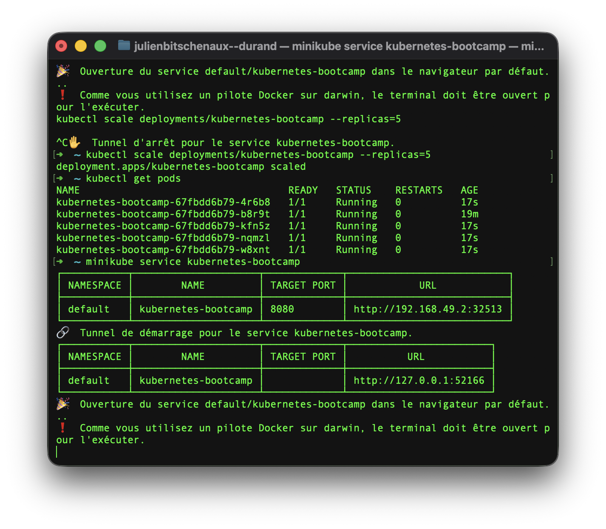
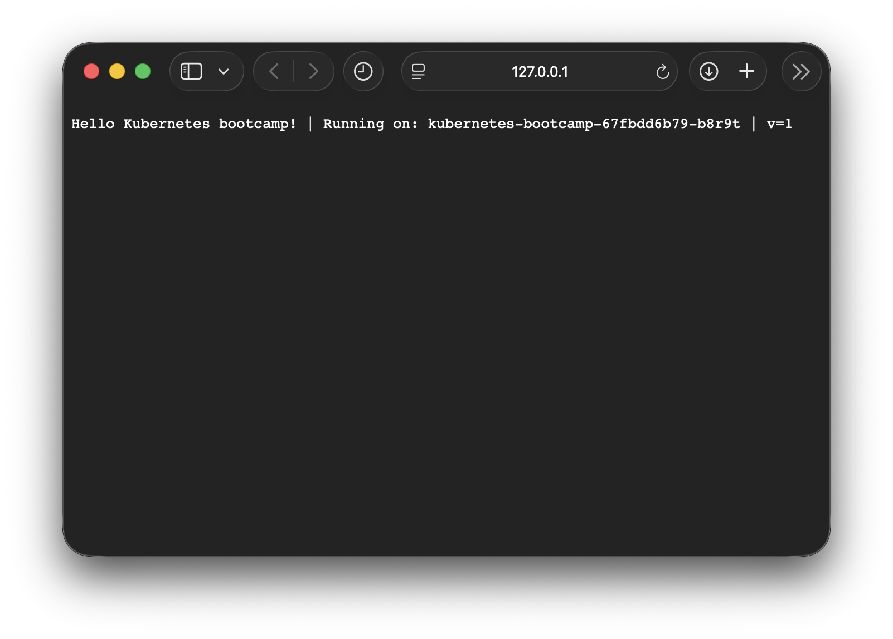

# Rapport de TP : Orchestration de conteneurs avec Kubernetes

**Nom :** Julien Bitschenaux--Durand

---

## 1. Introduction et Objectifs

L'objectif de ce TP était de se familiariser avec l'orchestration de conteneurs via Kubernetes (K8s). Nous avons exploré le déploiement d'applications, l'exposition de services, le passage à l'échelle (scaling) et la gestion déclarative via des fichiers YAML.

---

## 2. Mise en place de l'environnement

La première étape a consisté à installer `minikube` et `kubectl` via Homebrew et à démarrer le cluster local.

**Commande utilisée :**
```bash
minikube start
minikube status
```


---

## 3. Premier déploiement et inspection

Nous avons déployé l'image `kubernetes-bootcamp:v1`.

**Manipulations :**

1. Création du déploiement.
2. Inspection du Pod.
3. Accès au shell du conteneur pour vérifier le fichier `server.js`.

**Observation :** En inspectant le code source dans le pod, j'ai identifié que l'application écoute sur le port **8080**.


---

## 4. Exposition du Service et Scaling

Pour rendre l'application accessible depuis l'extérieur du cluster, nous avons créé un service **NodePort**.

**Scaling :**

Nous avons augmenté le nombre de répliques à 5 pour assurer la haute disponibilité.
```bash
kubectl scale deployments/kubernetes-bootcamp --replicas=5
```

**Observation :** En rafraîchissant le navigateur, le nom du Pod affiché changeait (ex: `kfn5z`, `4r6b8`). Cela prouve que le Load Balancer interne de Kubernetes répartit bien la charge entre les instances.




---

## 5. Gestion des mises à jour (Rolling Updates)

Nous avons testé la mise à jour vers la version `v2`, puis simulé une erreur avec une version `v3` inexistante.

**Observation d'erreur :** Lors du passage en `v3`, les pods affichaient le statut `ImagePullBackOff`. Cependant, l'application restait disponible car Kubernetes conservait les anciens pods `v2` fonctionnels.

**Commande de secours :**
```bash
kubectl rollout undo deployments/kubernetes-bootcamp
```


---

## 6. Déploiement via fichiers Manifest (YAML)

Enfin, nous avons utilisé une approche **"Infrastructure as Code"** en supprimant les ressources manuelles pour les recréer via des fichiers `deployment.yaml` et `service.yaml`.

**Extrait du fichier `deployment.yaml` :**
```yaml
spec:
  replicas: 3
  template:
    spec:
      containers:
      - name: kubernetes-bootcamp
        image: gcr.io/google-samples/kubernetes-bootcamp:v1
```
**Fichier `service.yaml` :**
```yaml
apiVersion: v1
kind: Service
metadata:
  name: kubernetes-bootcamp
spec:
  type: NodePort
  selector:
    app: kubernetes-bootcamp
  ports:
    - protocol: TCP
      port: 8080
      targetPort: 8080
```

**Observation :** Cette méthode permet de versionner l'infrastructure. Le déploiement s'est effectué correctement avec 3 répliques.


---

## 7. Conclusion

Ce TP a permis de comprendre le cycle de vie d'une application conteneurisée. La puissance de Kubernetes réside dans sa capacité à maintenir un **"état désiré"** (*self-healing*) et à gérer les mises à jour sans interruption de service.